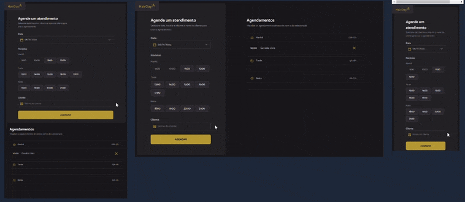

# ✂️ Projeto Hairday ✂️
Projeto desenvolvido durante Formação Full-Stack promovida pela Rocketseat.
___
## 💇🏽‍♂️ Layout direcionado para sistema de agendamento de corte de cabelo
  

  
___
### 🤖 Tecnologias e Recursos  
  
* HTML
* CSS
* JavaScript
* Day.js
* REST API
* Json-server
* Webpack
* Babel
* Git
* Figma
* Notion
* Responsiveness App

#### 🔎 Você pode conferir o resultado clicando [aqui](https://arturtinoco.github.io/hairday/) ou ver o projeto no [Figma](https://www.figma.com/community/file/1360316357733167308) feito por [Millena Martins](https://www.linkedin.com/in/millenamartins/).  